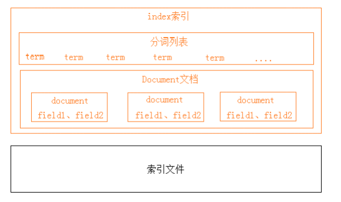
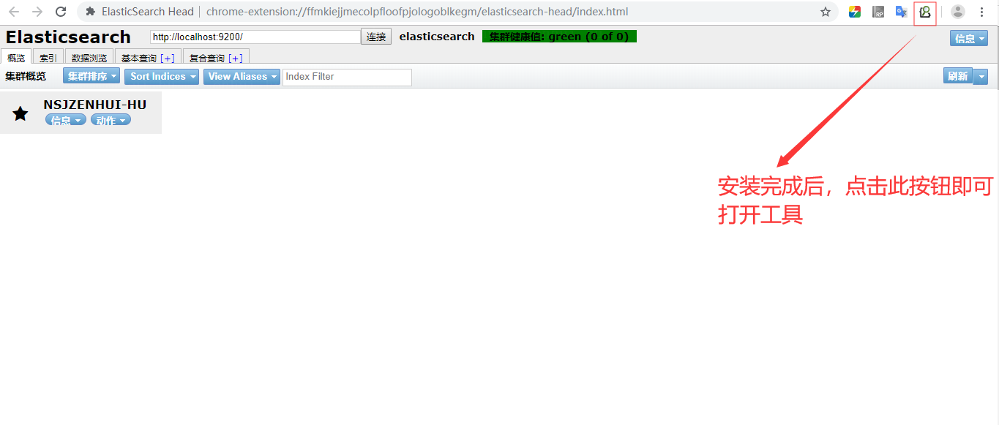

# ElasticSearch

## 介绍
ElasticSearch是一个基于Lucene的搜索服务器。
它提供了一个分布式多用户能力的全文搜索引擎，基于RESTful web接口。
Elasticsearch是用Java语言开发的，并作为Apache许可条款下的开放源码发布，是一种流行的企业级搜索引擎。
ElasticSearch用于云计算中，能够达到实时搜索，稳定，可靠，快速，安装使用方便。
根据DB-Engines的排名显示，Elasticsearch是最受欢迎的企业搜索引擎，其次是Apache Solr，也是基于Lucene。

官方网址:[https://www.elastic.co/cn/products/elasticsearch](https://www.elastic.co/cn/products/elasticsearch)       
Github:[https://github.com/elastic/elasticsearch](https://github.com/elastic/elasticsearch)

总结：
1. ElasticSearch是一个基于Lucene的高扩展的分布式搜索服务器，支持开箱即用。
2. ElasticSearch隐藏了Lucene的复杂性，对外提供Restful接口来操作索引、搜索。

优点：
1. 扩展性好，可部署上百台服务器集群，处理PB级数据。
2. 近实时的去索引数据，搜索数据

## 原理了解
下图是ElasticSearch的索引结构，下边黑色部分是物理结构，上面黄色部分是逻辑结构，
逻辑结构也是为了更好的去描述ElasticSearch的工作原理及去使用物理结构中的索引文件。     
        

逻辑结构部分是一个倒排索引表：
1. 将要搜索的文档内容分词，所有不重复的词组成分词列表
2. 将搜索的文档最终以document方式存储起来
3. 每个词和document都有关联

## 在Windows环境安装 ElasticSearch7.4.2
Elasticsearch是使用Java构建的，并且在每个发行版中都包含来自JDK维护者（GPLv2 + CE）的捆绑版本的 OpenJDK。
捆绑的JVM是推荐的JVM，位于Elasticsearch主目录的jdk目录内。        
要使用自己的Java版本，请设置JAVA_HOME环境变量。如果必须使用与捆绑的JVM不同的Java版本，
则建议使用受支持 的Java LTS版本。如果使用已知的Java错误版本，Elasticsearch将拒绝启动。
使用您自己的JVM时，可以删除捆绑的JVM目录。        

ElasticSearch7.4.2要求Java环境为jdk11。       
从官网下载windows环境的zip压缩包，解压即可             
下载地址:[https://artifacts.elastic.co/downloads/elasticsearch/elasticsearch-7.4.2-windows-x86_64.zip](https://artifacts.elastic.co/downloads/elasticsearch/elasticsearch-7.4.2-windows-x86_64.zip)   

配置文件(zip方式安装，配置文件在ES目录下的config中)：       
- elasticsearch.yml ： 用于配置Elasticsearch运行参数       
- jvm.options ： 用于配置Elasticsearch JVM设置       
- log4j2.properties： 用于配置Elasticsearch日志      

启动：直接双击bin目录下的[elasticsearch.bat] 脚本文件，然后浏览器访问9200端口
## 使用docker安装ES7.4.2
```
# 拉取镜像
docker pull elasticsearch:7.4.2

# 运行容器，注意设置内存，默认分配jvm空间大小为2g
docker run -e ES_JAVA_OPTS="-Xms128m -Xmx128m" -d -p 9200:9200 -p 9300:9300 --name docker_es elasticsearch:7.4.2

# 运行失败，查看日志命令：docker logs -f -t --tail 100 容器名称  

# 报错信息： max virtual memory areas vm.max_map_count [65530] is too low, increase to at least [262144]
# 解决方案：  使用命令：sudo sysctl -w vm.max_map_count=262144   设置后可用命令查看：sysctl -a
docker run -d -e ES_JAVA_POTS="-Xms128m -Xmx128m"  -e "discovery.type=single-node" -p 9200:9200 -p 9300:9300 --name docker_es elasticsearch:7.4.2
```
## ElasticSearch Head插件
最简单的方式，可以在谷歌商店搜索 ElasticSearch Head ，然后添加扩展程序       
  

## ElasticSearch 快速入门
### restful
- GET: 获取资源
- POST： 新建资源
- PUT：在服务器更新资源（向客户端提供改变后的所有资源）
- DELETE：删除资源
### 概念理解
1. Elasticsearch是面向文档型数据库，一条数据在这里就是一个文档，用JSON作为文档序列化的格式    
2. 将Elasticsearch和关系型数据术语对照表           
关系数据库     ⇒ 数据库 ⇒ 表    ⇒ 行    ⇒ 列(Columns)      
Elasticsearch  ⇒ 索引库(Index)   ⇒ 类型(type)  ⇒ 文档(Docments)  ⇒ 字段(Fields)  
注意：ES7.x版本已经移除type这个概念    
3. ES官方建议，在一个索引库中只存储相同类型的文档。
4. 分片和副本        
副本是分片的副本。分片有主分片和副本分片之分。（主从）     
一个index数据在物理上被分布在多个主分片上，每个主分片只存放部分数据。    
每个主分片可以有多个副本，叫副本分片，是主分片的复制。

### 创建索引库（理解为创建数据库）
ES的索引库是一个逻辑概念，它包括了分词列表及文档列表，同一个索引库中存储了相同类型的文档。     
 
>  可以使用head插件创建       
>  也可以使用 postman 工具创建  
put http://localhost:9200/索引名称
例子：put http://localhost:9200/test_index
```$xslt
{
    "settings":{
        "index":{
            "number_of_shards":1,
            "number_of_replicas":0
        }       
    }
}

```
number_of_shards：设置分片的数量，在集群中通常设置多个分片，表示一个索引库将拆分成多片分别存储不同的结点，
提高了ES的处理能力和高可用性，入门程序使用单机环境，这里设置为1。      
number_of_replicas：设置副本的数量，设置副本是为了提高ES的高可靠性，单机环境设置为0.
### 创建映射（理解为表结构）
在索引中每个文档都包括了一个或多个field，创建映射就是向索引库中创建field的过程
> 使用 postman 工具
post http://localhost:9200/索引库名称/_mapping
例子：http://localhost:9200/test_index/_mapping
包含三个字段  name description studymodel
```
{
    "properties": {
        "name": {
            "type": "text"
        },
        "description": {
            "type": "text"
        },
        "studymodel": {
            "type": "keyword"
        }
    }
}

```
> 查询所有索引的映射 ```get http://localhost:9200/_mapping ```       
更新操作与新增一致：有就修改，没有就添加。但是字段类型不能被修改，字段也不能被删除。也就是只能添加(字段)

### 创建文档（理解为添加一条数据）
> 使用 postman 工具 
post或put http://localhost:9200/索引库名称/默认类型名称/文档编号
例子：http://localhost:9200/test_index/_doc/1
```
{
	"name":"胡",
	"description":"学习",
	"studymodel":"java"
}

```
更新文档也可以用这种方式：先删除后创建
### 搜索文档（理解为查询数据）
> 使用 postman 工具 
get http://localhost:9200/索引库名称/默认类型名称/文档编号
例子：http://localhost:9200/test_index/_doc/1
get http://localhost:9200/索引库名称/_doc/_search
例子：http://localhost:9200/test_index/_doc/_search        
带条件：get http://localhost:9200/test_index/_search?q=字段:条件
例如：get http://localhost:9200/test_index/_search?q=name:胡


## 分词器的使用

### 使用es的默认分词
> post  localhost:9200/_analyze
```
{"text":"测试分词器，后边是测试内容：SpringCloud实战"}
```
默认分词对中文效果不好，分为单字为一词

### 使用IK分词器
下载ik分词器：https://github.com/medcl/elasticsearch-analysis-ik/releases     
选择对应版本，下载zip压缩包，解压后放入es安装目录的plugin下     
重启es后测试是否成功
> post  localhost:9200/_analyze
```
{"text":"测试分词器，后边是测试内容：SpringCloud实战","analyzer":"ik_max_word"}
```
1. ik_max_word
会将文本做最细粒度的拆分。比如 "人民大会堂"：人民、大会、大会堂、会堂等词语
2. ik_smart
会做最粗力度的拆分。比如 "中华人民共和国人民大会堂"：中华人民共和国、人民大会堂

### 自定义词库
如果要让分词器支持一些专有名词，可以自定义词库。        
IK分词器自带一个main.dic的文件，此文件为系统自带的词库文件（在插件ik分词器的config目录下）   
    
在config目录下，有一个 IKAnalyzer.cfg.xml 的配置文件，打开配置文件，可以在对应位置填写自定义文件目录     
例如：mymain.dic  然后在config目录下创建名为 mymain.dic 的文件，文件中写入关键词，一词一行。（注意：保存为utf-8编码格式）

```
<?xml version="1.0" encoding="UTF-8"?>
<!DOCTYPE properties SYSTEM "http://java.sun.com/dtd/properties.dtd">
<properties>
	<comment>IK Analyzer 扩展配置</comment>
	<!--用户可以在这里配置自己的扩展字典 -->
	<entry key="ext_dict">mymain.dic</entry>
	 <!--用户可以在这里配置自己的扩展停止词字典-->
	<entry key="ext_stopwords"></entry>
	<!--用户可以在这里配置远程扩展字典 -->
	<!-- <entry key="remote_ext_dict">words_location</entry> -->
	<!--用户可以在这里配置远程扩展停止词字典-->
	<!-- <entry key="remote_ext_stopwords">words_location</entry> -->
</properties>

```

### 常用的映射类型
- String(字符串)
```puml
{
    "properties": {
        "name": {
            "type": "text",
            "analyzer":"ik_max_word", 
            "search_analyzer":"ik_smart", 
            "index":"false",
            "store":""
         
        }
    }
}
```
1. analyzer属性
如果单独指定 analyzer 属性，则索引和搜索都使用此分词器;如果单独定义搜索时使用的分词器，可以通过 search_analyzer 属性        
对于ik分词器使用建议：索引时使用 ik_max_word将搜索内容进行细粒度分词（分词内容）;搜索时使用 ik_smart 提高搜索精确性（分词搜索内容）

2. index属性
通过index属性指定是否索引，默认 index=true，只有进行索引才可以从索引库搜索到

3. store
是否在source之外存储，每个文档索引后会在ES中保存一份原始文档，存放在"_source"中，
默认为false,一般情况下不需要设置store为true，因为在_source中已经有一份原始文档了

- keyword(关键字)
```puml
{
    "studymodel": {
         "type": "keyword"
    }
}
```
不进行分词，精准匹配

- format(日期格式)
```puml
{ 
     "timestamp":{
        "type":"date",
        "format":"yyyy-MM-dd HH:mm:ss||yyyy-MM-dd"
     }   
}
```
插入文档
> post http://localhost:9200/test_index/_doc/3
```puml
{
    "name":"java开发",
    "timestamp":"2018-07-04 18:28:58"
}
```

- 数值类型
1. 尽量选择范围小的类型，提高搜索效率
2. 对于浮点数尽量用比例因子，比如一个价格字段，单位为元，我们将比例因子设置为100，这在ES中会按 分 保存，映射如下
```puml
{
    "price":{
        "type":"scaled_float",
        "scaling_factor":100
    }
}
```
由于比例因子为100，如果我们输入的价格是23.45，则ES会将23.45乘以100存储在ES中        
如果输入的价格是23.456，ES会将23.456乘以100在取一个接近原始值的数，得到2345        
使用比例因子的好处是整形比浮点型更容易压缩，节省磁盘空间        

